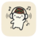

<div align="center">
  

  # Laya Music

  *A native Android client for streaming YouTube Music with a focused, lightweight, and beautiful interface.*

  <a href="https://developer.android.com/"></a>
  <a href="https://kotlinlang.org/"></a>
  <a href="https://developer.android.com/compose"></a>
  <a href="LICENSE"></a>
</div>

---

## 📸 Screenshots

<div align="center">
  
  
  
  
  <br>
  
  
  
</div>

---

## ✨ Key Features

Laya Music prioritizes a responsive playback experience while retaining a clean, maintainable architecture.

*   **🎧 Seamless Streaming:** Search and stream tracks, albums, and playlists directly from YouTube Music.
*   **💾 Offline Mode:** Download your favorite music for local playback.
*   **🎤 Synchronized Lyrics:** Real-time, line-synced lyrics powered by LRCLIB, with plain-text fallback and Room caching.
*   **🎨 Material You:** Beautiful Material 3 interface with dynamic color theming.
*   **🚗 Android Auto:** Full media controls and voice search handling for your daily commute.
*   **👤 Account Sync:** Sign in to access personal playlists, history, and tailored recommendations.
*   **⚡ Background Playback:** Reliable background audio powered by Media3 and ExoPlayer.

## 🛠️ Technology Stack

| Component | Technology |
| :--- | :--- |
| **Language** | Kotlin 2.4.0 |
| **UI** | Jetpack Compose & Material 3 |
| **Playback** | AndroidX Media3 / ExoPlayer |
| **Concurrency** | Coroutines & Flow |
| **Storage** | Room & DataStore |
| **Networking**| OkHttp & Coil 3 (Images) |
| **Extraction**| NewPipeExtractor |
| **SDK Specs** | Min: API 24 (Android 7.0) / Target: API 35 |

## 📦 Releases & Signing

Releases are cut by pushing a `vX.Y.Z` tag — the workflow builds, verifies the signing certificate, and creates the GitHub Release automatically. See **[RELEASING.md](RELEASING.md)** for the full release procedure, the signing identity, and keystore recovery.

> ⚠️ **v1.0.3 users:** the v1.0.3 APK was accidentally debug-signed; uninstall it before installing v1.0.4 (one-time exception, see the [v1.0.4 release notes](https://github.com/nishan-bajagain/laya-music/releases)).

## 🚀 Getting Started

### Prerequisites
*   JDK 21
*   Android SDK (API 37 preview platform)
*   Android Studio (Recommended)

### Build Locally

1. **Clone the repository:**
   ```bash
   git clone [https://github.com/nishan-bajagain/laya-music.git](https://github.com/nishan-bajagain/laya-music.git)
   cd laya-music
